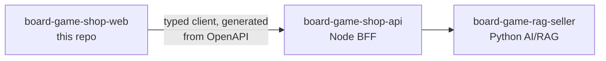

# board-game-shop-web — storefront UI (React + TypeScript)

> 🚧 Planning stage. This repo will host the storefront's React app; for now it holds
> the app's intent and plan. See [PLAN.md](PLAN.md) for the phased roadmap.

The customer-facing UI of a small board-game e-commerce demo: browse the catalog, add
games to a cart, place (simulated) orders — and talk to a conversational AI advisor
embedded in the shop, the same advisor measured in the AI service's eval suites.
It is one of three repositories that together form the storefront system:

| Repo                                                                        | Role                                                                                                                     |
| --------------------------------------------------------------------------- | ------------------------------------------------------------------------------------------------------------------------ |
| [board-game-rag-seller](https://github.com/msporchia/board-game-rag-seller) | Python AI/RAG service — enrichment pipeline, hybrid search, conversational advisor (LangChain/LangGraph, Qdrant, Ollama) |
| [board-game-shop-api](https://github.com/msporchia/board-game-shop-api)     | Node commerce backend and BFF — products, orders, customers                                                              |
| **board-game-shop-web** (this repo)                                         | React storefront UI                                                                                                      |

## What the UI makes visible

Everything the AI service does well — grounded recommendations, hybrid retrieval,
session memory — is invisible from `curl`. This app closes the loop:

- The **chat advisor** recommends real catalog games as clickable cards; you can add a
  recommendation to the cart **without leaving the conversation** — the
  conversational-commerce loop the whole demo exists to show.
- The **product page** renders the enriched description produced by the AI service's
  ingestion pipeline.
- **Faceted search** exposes the structured-filter side of hybrid retrieval (players,
  duration, complexity, category).
- **Orders feed the system back**: purchase history becomes the advisor's long-term
  memory — cross-session personalization ("buongiorno, ti sei divertito con Azul?"),
  distinct from per-conversation session memory.

The browser talks **only** to the shop BFF:



## Stack

|              | Choice                                                       | Why                                                                                  |
| ------------ | ------------------------------------------------------------ | ------------------------------------------------------------------------------------ |
| Build        | Vite + React 19 + TypeScript strict                          | Current defaults; strict TS mirrors the backend contracts                            |
| Server state | TanStack Query                                               | Caching/retry/invalidation without hand-rolled fetch state                           |
| Client state | React Context + `useReducer` (cart)                          | The cart is small and local — core React primitives over a state library, on purpose |
| Routing      | React Router                                                 | Catalog `/`, product `/games/:id`, search, checkout                                  |
| API types    | Generated from the BFF's OpenAPI spec (`openapi-typescript`) | No hand-maintained DTO duplicates                                                    |
| Identity     | `customer_id` + chat `session_id` in localStorage            | Demo identity, no auth; makes session memory tangible across reloads                 |
| Styling      | Tailwind CSS, no component kit                               | The UI is part of the showcase — distinctive, not template-like                      |
| Tests        | Vitest + React Testing Library + MSW                         | Behavior tested against mocked HTTP contracts                                        |

## Structure convention

- **Folder = feature** (`catalog/`, `cart/`, `chat/`), not folder-by-type.
- **One component per file**; a private subcomponent serving only the file's
  protagonist may cohabit.
- **Components never `fetch`** — behavior lives in custom hooks (`useCart`,
  `useChatSession`) over a typed API layer.
- **Deep, explicit imports** — no barrel `index.ts` re-exports.

## Development

Sibling checkouts expected: this repo next to `board-game-shop-api` and
`board-game-rag-seller` (which owns the docker-compose stack). Standalone dev:
`npm run dev` against a running BFF. Full-stack orchestration: documented in the
seller repo.

Requires Node 22+. The BFF base URL is read from `VITE_SHOP_API_URL` (browser-side,
defaults to `http://localhost:3000`); copy `.env.example` to `.env` to override.
The home page renders an "offline" state when the BFF is unreachable, so the app
runs without it.

```bash
npm install         # install dependencies
npm run dev         # Vite dev server (http://localhost:5173)
npm run build       # tsc -b && vite build (production bundle)
npm run preview     # serve the built bundle
npm run typecheck   # tsc -b, no emit
npm run lint        # eslint .
npm run format      # prettier --write .   (format:check in CI)
npm test            # vitest run           (test:watch for watch mode)
```

Dockerised dev (joins the seller compose stack): `docker compose up --build`,
serving on `http://localhost:5173`.
