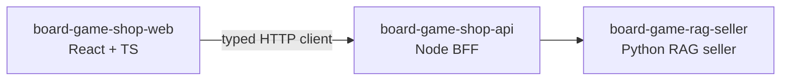

# board-game-shop-web — React/TypeScript demo UI for a RAG seller

> **Portfolio/showcase repo.** This is a deliberately small React storefront whose
> main job is to make the board-game RAG seller visible, testable and recordable.
> It is not trying to become a complete e-commerce product.

The app is the browser surface for a three-repo demo:

| Repo                                                                        | Role                                                                                     |
| --------------------------------------------------------------------------- | ---------------------------------------------------------------------------------------- |
| [board-game-rag-seller](https://github.com/msporchia/board-game-rag-seller) | Python AI/RAG service — enrichment pipeline, hybrid retrieval, conversational seller     |
| [board-game-shop-api](https://github.com/msporchia/board-game-shop-api)     | Node BFF — the only service the browser talks to; adapts products, cart, orders and chat |
| **board-game-shop-web** (this repo)                                         | React + TypeScript UI — minimal shop flow plus the filmed conversational advisor demo    |

## What this repo is meant to prove

The codebase is intentionally compact so it can be reviewed quickly. It should show
that I can work with React and TypeScript in a production-shaped way:

- strict TypeScript, explicit domain contracts and typed API calls;
- server state with TanStack Query instead of hand-rolled loading/cache logic;
- route-driven catalog/detail/checkout flows with React Router;
- optimistic cart mutations with rollback and server reconciliation;
- behavior tests with Vitest, React Testing Library and MSW at the HTTP boundary;
- a UI polished enough to record as the front-end demo for the RAG project.

## Showcase focus

The commerce flow stays small on purpose:

- catalog grid;
- product detail page;
- server-side cart;
- simulated checkout/order recap.

Those screens provide enough real application shape to demonstrate React/TS and to
make recommended games buyable. The distinctive part should be the **chat advisor**:

- a filmable conversation panel;
- quick replies that are sent back to the seller as real choices/filters;
- grounded game recommendations rendered as cards inside the conversation;
- add-to-cart directly from a recommendation;
- persisted `session_id` so the demo can show conversational memory across turns.

That is the sensible "special" part: it directly exposes the RAG seller's purpose,
instead of adding complexity just to make the UI look busy.

## Current status

Implemented in this repo:

- Vite + React 19 + TypeScript strict setup;
- catalog and product detail pages;
- BFF-only API layer;
- OpenAPI-generated BFF contract types (`npm run generate:api`);
- server-side cart and checkout client, with optimistic updates;
- chat advisor panel with quick replies, recommendation cards and add-to-cart;
- shared loading/error/empty states;
- MSW-backed tests for catalog, product detail, cart, checkout, chat and health;
- CI-ready scripts for lint, format, typecheck, test and build.

Next focus:

1. run the chat flow against the real local stack once `seller` and `seller-shop`
   are both up;
2. polish the chat panel enough for the short RAG demo recording;
3. improve drawer accessibility basics (focus, Escape, `aria-modal`);
4. add a GIF/screenshots once the real chat flow is filmed.

## Architecture

The browser talks only to the BFF. The web app never calls the Python RAG service
directly.



The contracts in `src/contracts/` are generated from the BFF OpenAPI document. Run
`npm run generate:api` while `seller-shop` is serving `http://localhost:3000/docs/json`
to refresh `src/contracts/openapi.ts`; feature-level contract files re-export typed
slices from that generated source.

## Stack

|              | Choice                                               | Why                                                                                        |
| ------------ | ---------------------------------------------------- | ------------------------------------------------------------------------------------------ |
| Build        | Vite + React 19 + TypeScript strict                  | Modern React app with strict compile-time checks                                           |
| Server state | TanStack Query                                       | Caching, retries, invalidation and optimistic updates without custom fetch state           |
| Routing      | React Router                                         | Small route tree: catalog `/`, product `/games/:id`, checkout `/checkout`                  |
| Cart & money | Server-side cart on the BFF                          | Prices, totals and order creation belong to the backend; the client renders and reconciles |
| API boundary | OpenAPI-generated BFF contracts + typed API modules  | Components consume hooks; fetch details stay outside the UI                                |
| Identity     | `customer_id` and later `session_id` in localStorage | Demo identity, no auth; enough to show cart persistence and conversational memory          |
| Styling      | Tailwind CSS, no component kit                       | Keeps the UI lightweight and custom enough for a portfolio/demo                            |
| Tests        | Vitest + React Testing Library + MSW                 | User flows tested against mocked HTTP contracts, not mocked hooks                          |

## Structure convention

- **Folder = feature** (`catalog/`, `cart/`, `checkout/`, `chat/`), not folder-by-type.
- **One component per file**; a private subcomponent serving only the file's main
  component may cohabit.
- **Components never `fetch`** — data access lives in the API layer and custom hooks.
- **Everything remote is server state** via TanStack Query.
- **Deep, explicit imports** — no barrel `index.ts` re-exports.
- **User-facing copy is Italian**; code, comments and docs are English.

## Development

Sibling checkouts expected: this repo next to `board-game-shop-api` / `seller-shop`
and `board-game-rag-seller` / `seller`. Standalone dev: `npm run dev` against a
running BFF. Full-stack orchestration lives in the seller repo.

Requires Node 22+. The BFF base URL is read from `VITE_SHOP_API_URL` (browser-side,
defaults to `http://localhost:3000`); copy `.env.example` to `.env` to override.
When the BFF is unreachable, the app renders error/offline states instead of crashing.

```bash
npm install         # install dependencies
npm run dev         # Vite dev server (http://localhost:5173)
npm run build       # tsc -b && vite build (production bundle)
npm run preview     # serve the built bundle
npm run generate:api # regenerate BFF OpenAPI types from http://localhost:3000/docs/json
npm run typecheck   # tsc -b, no emit
npm run lint        # eslint .
npm run format      # prettier --write .   (format:check in CI)
npm test            # vitest run           (test:watch for watch mode)
```

Dockerised dev: `docker compose up --build`, serving on `http://localhost:5173`.
